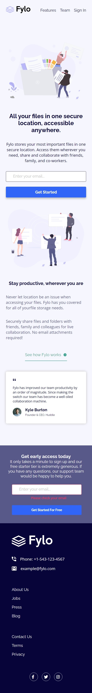

This is a solution to the [Fylo landing page with two column layout challenge on Frontend Mentor](https://www.frontendmentor.io/challenges/fylo-landing-page-with-two-column-layout-5ca5ef041e82137ec91a50f5). Frontend Mentor challenges help you improve your coding skills by building realistic projects. 

___
.png)
- [Overview](#overview)
  - [The challenge](#the-challenge)
  - [Screenshot](#screenshot)
  - [Links](#links)
- [My process](#my-process)
  - [Built with](#built-with)
  - [What I learned](#what-i-learned)
  - [Continued development](#continued-development)
- [Author](#author)
___
.png)
### The challenge

Users should be able to:

- View the optimal layout for the site depending on their device's screen size
- See hover states for all interactive elements on the page
___
### Screenshots
### Desktop


### Mobile

___
### Links

- [Solution URL](https://github.com/HadjerL/Frontend-Mentor-Fylo-landing-page-with-two-xolumn-layout.git)
- [Live Site URL](https://your-live-site-url.com)

____
.png)
### Built with

- Semantic HTML5 markup
- CSS custom properties
- Flexbox
- CSS Grid
- Mobile-first workflow
- [FontAwesome](https://fontawesome.com/) - For Icons
___
### What I learned

In this chllenge I have learned how to use regular expressions to do email validation. I have learned how to organise my code for it was bigger than a simple component. I have learned how to use event listeners and how to style elements using JavaSctipt

Some code:
___
```html
<h1>Some HTML code I'm proud of</h1>
```

___
```css
.proud-of-this-css {
  color: papayawhip;
}
```

___
```js
const proudOfThisFunc = () => {
  console.log('🎉')
}
```

___
### Continued development

I believe I have to get more comfortable with using JavaScript in the future. Also I still need to be more organized with my work.
___
.png)
- Frontend Mentor - [@HadjerL](https://www.frontendmentor.io/profile/HadjerL)
